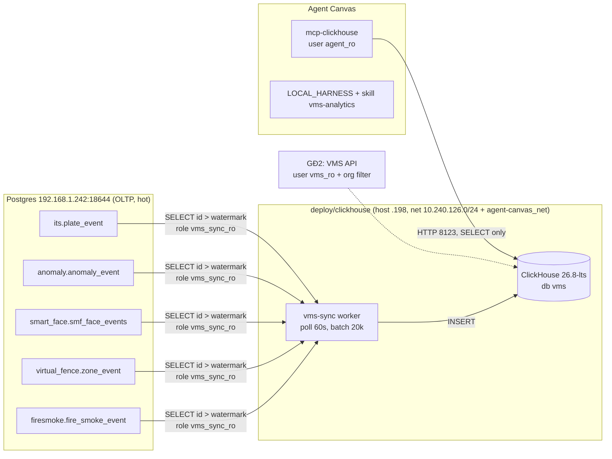
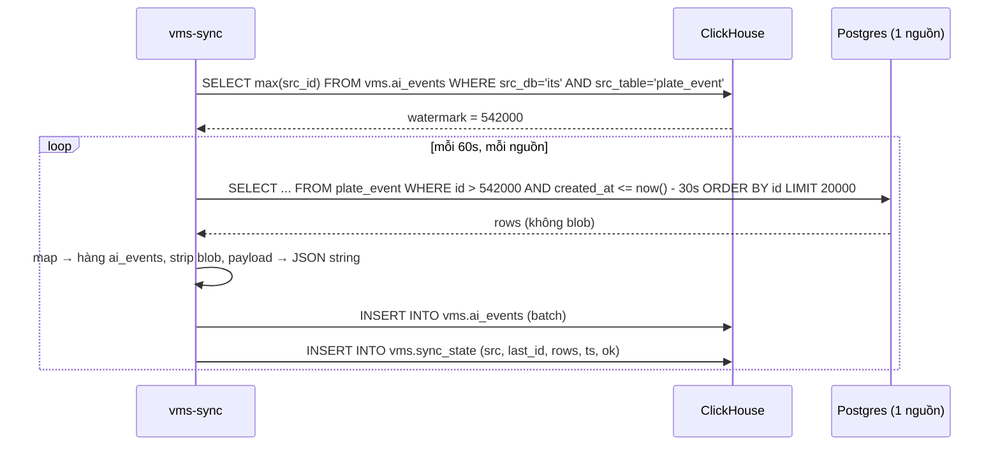

# ClickHouse VMS Warehouse - Implementation Plan

> Category: **Add Feature** · Ngày: 2026-09-08 · Trạng thái: **Đã implement GĐ1**
>
> Mục tiêu: dựng ClickHouse làm kho **dài hạn** cho AI events của VMS (SmartFace, Virtual Fence, Anomaly, ITS/biển số, Fire/Smoke). Giai đoạn 1 phục vụ **agent Creanova** qua **tools** (`local-gateway` `/api/infra/analytics/*`, MCP `vms_*`) — agent **không viết SQL**; thiết kế sẵn nền cho giai đoạn 2 (**VMS UI/API**). Postgres vẫn là source of truth cho state, config, PII, blob.

---

## Phase 0: Input Clarification

| Mục | Giá trị đã xác nhận |
|-----|---------------------|
| Ngôn ngữ / framework | Python 3.12 (sync worker, theo pattern `services/*`), Docker Compose (`deploy/*`), ClickHouse SQL, TypeScript (chỉ sửa text prompt `LOCAL_HARNESS`) |
| Codebase | Mở rộng repo hiện có (`deploy/`, `services/`, `skills/`, `agent-canvas/`) |
| Scope | Multi-module: hạ tầng mới (ClickHouse) + service mới (`vms-sync`) + tích hợp agent (MCP + prompt + skill) |
| Security level | **Internal / Critical-data**: event chứa PII (tên người, biển số, ảnh). Kho phân tích **không** chứa ảnh/base64/face_feature. Agent chỉ có user **read-only**. |
| Environment | Backend on-prem, LAN `192.168.1.0/24`. ClickHouse chạy trên host `192.168.1.198` (máy này: 104 core, 125 GB RAM, ~1.5 TB NVMe trống). Postgres nguồn ở `192.168.1.242:18644` (PG 16.14, Timescale 2.28 chưa dùng hypertable). |
| Constraints | Docker bridge phải nằm trong `10.240.0.0/16` (network.md). Không đổi code 5 app AI đang ghi Postgres. Không restart Postgres nguồn (`wal_level=replica`, không bật logical CDC ở giai đoạn này). Versioning theo `.cursor/rules/versioning-and-commits.mdc`. |
| Ai dùng | **GĐ1**: agent Creanova (Agent Canvas, `LOCAL_HARNESS`). **GĐ2**: VMS backend/UI (API có org-scoping) - thiết kế sẵn, chưa làm task. |

### Dữ liệu nguồn đã khảo sát (Postgres `192.168.1.242:18644`)

| DB | Bảng | Cột thời gian | Rows hiện tại | Tốc độ/ngày (peak tuần qua) | Ghi chú blob |
|----|------|---------------|---------------|------------------------------|--------------|
| `its` | `plate_event` | `event_time` | ~542k (từ 2026-03) | **125k-150k** | `snapshot_base64` |
| `anomaly` | `anomaly_event` | `event_time` | ~134k | **25k-33k** | `snapshot_base64`, payload ~1.1 KB có `raw_payload` |
| `smart_face` | `smf_face_events` | `access_time` | ~40k | 60-750 | `image` (text), `face_feature` (bytea) |
| `virtual_fence` | `zone_event` | `event_time` | ~20k | 60-5k | `snapshot_base64` |
| `firesmoke` | `fire_smoke_event` | `event_time` | ~7k | 0-600 | `snapshot_base64` |

Ước lượng: **~50-60M dòng/năm**, chủ yếu biển số + anomaly. Bỏ blob thì mỗi dòng ~300-800 B raw, ClickHouse nén ~5-10x → **~5-15 GB/năm**.

Không đưa vào kho GĐ1: `vms_db.ai_event` (0 row, chờ hub ingest), `vms_db.notifications` (bản sao đã có ở bảng nguồn), `zone_presence` (state hiện tại - hỏi Postgres), `footfall`, `ppe`, `thermal` (rất ít; thêm sau bằng 1 mapping mỗi bảng).

---

## Phase 1: Requirements Analysis (EARS)

### User stories

- **US1** (agent): "Tháng trước camera nào có nhiều cảnh báo leo trèo nhất?" → agent trả lời từ ClickHouse trong vài giây, không đụng Postgres production.
- **US2** (agent): "Biển số 30A-xxx xuất hiện ở đâu trong 6 tháng qua?" → tra `ai_events` theo `license_plate`.
- **US3** (ops): Postgres nguồn được giữ ngắn hạn sau này mà không mất lịch sử.
- **US4** (VMS, GĐ2): UI xem báo cáo nhiều tháng theo org mà không query trực tiếp ClickHouse từ client.

### EARS

| ID | Requirement |
|----|-------------|
| R1 | WHEN có dòng mới ở bất kỳ bảng nguồn nào THE SYSTEM SHALL chép dòng đó vào `vms.ai_events` trong **≤ 5 phút** (poll mặc định 60 s). |
| R2 | WHEN chép dữ liệu THE SYSTEM SHALL **loại bỏ** `snapshot_base64`, `image`, `face_feature` và mọi cột blob; chỉ giữ `snapshot_url`/`video_clip_url`. |
| R3 | WHEN sync worker khởi động lại THE SYSTEM SHALL tiếp tục từ watermark cuối (không chép trùng, không bỏ sót) mà không cần trạng thái ngoài ClickHouse. |
| R4 | WHEN cùng một dòng nguồn được chép hai lần THE SYSTEM SHALL chỉ giữ một bản (idempotent theo `(src_db, src_table, src_id)`). |
| R5 | WHEN agent gọi tool MCP ClickHouse THE SYSTEM SHALL chỉ cho phép `SELECT`/`SHOW`/`DESCRIBE` với user `agent_ro` (readonly, giới hạn thời gian/RAM/số dòng). |
| R6 | WHEN một bảng nguồn không truy cập được THE SYSTEM SHALL vẫn sync các bảng khác và ghi log lỗi; không dừng toàn bộ worker. |
| R7 | WHEN event cũ hơn `RETENTION_YEARS` (mặc định 3) THE SYSTEM SHALL tự xóa theo TTL partition tháng. |
| R8 | WHEN người vận hành chạy `docker compose up -d` trong `deploy/clickhouse/` THE SYSTEM SHALL tạo schema, user, quota tự động (init script), không thao tác tay. |
| R9 | WHEN ClickHouse khởi động THE SYSTEM SHALL chỉ lắng nghe loopback trên host và mạng Docker `agent-canvas_net`; mở LAN là quyết định riêng ở GĐ2. |
| R10 | WHEN agent nhận câu hỏi lịch sử VMS THE SYSTEM SHALL có chỉ dẫn (`LOCAL_HARNESS` + skill) để chọn ClickHouse thay vì SSH/Postgres. |
| R11 | WHEN backfill lần đầu THE SYSTEM SHALL chép toàn bộ lịch sử hiện có (≈ 750k dòng) theo batch, hoàn tất < 30 phút, không khóa bảng nguồn. |
| R12 | WHEN kiểm tra sau backfill THE SYSTEM SHALL cho phép so khớp `count(*)` per nguồn giữa Postgres và ClickHouse (script verify). |

### Non-functional

- Query agent điển hình (group by camera/module trên 1-12 tháng) **< 3 s**.
- Sync worker dùng Postgres role **read-only riêng** (`vms_sync_ro`), không dùng superuser `dev`.
- Không ghi mật khẩu vào repo; chỉ `.env.example`.
- Không phá pattern hiện có: mỗi stack một `deploy/<name>/docker-compose.yml`, subnet pinned, ghi vào bảng subnet trong `network.md`.

### Ngoài phạm vi (explicit)

- Xóa/rút retention Postgres nguồn (quyết định sau khi ClickHouse chạy ổn ≥ 1 tháng).
- Logical CDC / Debezium / Kafka.
- API VMS + org-scoping + UI (GĐ2 - có thiết kế sơ bộ ở cuối).
- Dashboard Grafana/Metabase.
- Sao chép ảnh vào object storage.

---

## Phase 2: Specification

### 2.1 Kiến trúc



Nguyên tắc:

- **Postgres = hot + state + PII đầy đủ + blob.** Không đổi.
- **ClickHouse = cold analytics**, một bảng phẳng `vms.ai_events` cho mọi module (không copy 5 schema).
- **Pull tăng dần** từ Postgres bằng worker nhỏ; không dual-write, không đụng app AI.

**Upstream `ClickHouse/` (tag `v26.8.2.7-lts`):** chỉ dùng phần phục vụ plan — image Hub (cùng tag), overlay `config.d`, entrypoint `initdb.d`, engine MergeTree/TTL/MV trong binary, HTTP parameterized query. Không compile `src/` / `contrib/`, không Keeper/cluster, không `MaterializedPostgreSQL`. Chi tiết: `deploy/clickhouse/UPSTREAM.md`.

### 2.2 Data flow sync



Watermark theo `id` (bigserial). Lùi 30 s theo `created_at` để né commit lệch thứ tự (id nhỏ commit sau id lớn). Nếu batch đầy 20k → lặp ngay không chờ 60 s (backfill nhanh).

### 2.3 Schema ClickHouse (db `vms`)

```sql
CREATE TABLE vms.ai_events
(
  event_time      DateTime64(3, 'UTC'),
  module          LowCardinality(String),   -- FACE | PLATE | ZONE | ANOMALY | FIRE
  event_type      LowCardinality(String),   -- e.g. INTRUSION_DETECTION, IN/OUT, HIGH
  severity        LowCardinality(String),
  organization_id Int64,
  site_id         Int64,
  iam_area_id     Int64,
  iam_zone_id     Int64,
  node_id         Int64,
  node_path       String,
  camera_id       UUID,
  camera_code     LowCardinality(String),
  camera_name     String,
  zone_id         String,                   -- uuid text; rỗng nếu không có
  zone_name       String,
  entity_type     LowCardinality(String),
  entity_id       String,
  direction       LowCardinality(String),
  confidence      Float32,
  person_id       Int64,                    -- FACE
  person_name     String,                   -- FACE / ZONE (PII, xem 2.7)
  license_plate   String,                   -- PLATE normalized / ZONE
  snapshot_url    String,
  video_clip_url  String,
  attrs           Map(LowCardinality(String), String),  -- cột phẳng theo module (plate_color, vehicle_type, alert_level, water_level, ...)
  payload         String CODEC(ZSTD(3)),    -- JSON nguồn đã strip blob
  src_db          LowCardinality(String),
  src_table       LowCardinality(String),
  src_id          Int64,
  created_at      DateTime64(3, 'UTC'),
  ingested_at     DateTime DEFAULT now()
)
ENGINE = ReplacingMergeTree(ingested_at)
PARTITION BY toYYYYMM(event_time)
ORDER BY (module, organization_id, event_time, src_db, src_table, src_id)
TTL toDateTime(event_time) + INTERVAL 3 YEAR
SETTINGS index_granularity = 8192;

-- skip index cho tìm biển số / người
ALTER TABLE vms.ai_events ADD INDEX idx_plate license_plate TYPE bloom_filter GRANULARITY 4;
ALTER TABLE vms.ai_events ADD INDEX idx_camera camera_id TYPE bloom_filter GRANULARITY 4;

-- tổng hợp ngày cho dashboard/agent nhanh
CREATE MATERIALIZED VIEW vms.ai_events_daily_mv
ENGINE = SummingMergeTree
PARTITION BY toYYYYMM(day)
ORDER BY (organization_id, module, event_type, camera_id, day)
AS SELECT toDate(event_time) AS day, organization_id, module, event_type, camera_id, any(camera_name) AS camera_name, count() AS events
FROM vms.ai_events GROUP BY day, organization_id, module, event_type, camera_id;

CREATE TABLE vms.sync_state
(
  src_db LowCardinality(String), src_table LowCardinality(String),
  last_id Int64, rows_copied UInt32, ok UInt8, error String, run_at DateTime DEFAULT now()
) ENGINE = MergeTree ORDER BY (src_db, src_table, run_at) TTL run_at + INTERVAL 90 DAY;
```

Mapping nguồn → cột (5 mapping, code Python, không config file):

| Nguồn | `module` | `event_type` | `entity/identity` | `attrs` |
|-------|----------|--------------|-------------------|---------|
| `its.plate_event` | `PLATE` | `direction` (IN/OUT) | `license_plate = normalized_license_plate`, `entity_id` | `plate_color, vehicle_type, car_type, manufacturer, vehicle_color, is_blacklisted, is_whitelisted, license_plate_status` |
| `anomaly.anomaly_event` | `ANOMALY` | `event_type` (INTRUSION_DETECTION...) | `entity_type/id`, `zone_id/name` | `submodule_code, water_level, warning_threshold, danger_threshold, trend, unit` (từ payload) |
| `smart_face.smf_face_events` | `FACE` | `direction` hoặc `event_type_id` | `person_id, person_name = user_name` | `user_code, department_name, area_name, device_name, person_type, score_match, gender, age, status` |
| `virtual_fence.zone_event` | `ZONE` | `direction` | `person_name, person_identity → entity_id, license_plate` | `zone_name_cached` |
| `firesmoke.fire_smoke_event` | `FIRE` | `alert_level` | `entity_type/id` | `alert_level` |

Thiếu cột ở nguồn → giá trị rỗng/0, không NULL (tránh Nullable trong ORDER BY).

### 2.4 Users / quyền ClickHouse

| User | Quyền | Giới hạn | Dùng bởi |
|------|-------|----------|----------|
| `default` (admin) | ALL, access management | - | ops, init |
| `vms_sync` | `INSERT, SELECT` trên `vms.*` | - | `vms-sync` |
| `agent_ro` | `SELECT` trên `vms.*`, `SHOW` | profile `readonly=1`, `max_execution_time=30`, `max_result_rows=5000` (`result_overflow_mode=break`), `max_memory_usage=4GiB`, `max_rows_to_read=2e9`; quota 600 query/giờ | `mcp-clickhouse` |
| `vms_ro` | `SELECT` trên `vms.*` | profile giống `agent_ro` nhưng `max_result_rows=100000` | GĐ2 API |

Tạo bằng `docker-entrypoint-initdb.d/02_users.sh` đọc mật khẩu từ env (`CH_SYNC_PASSWORD`, `CH_AGENT_PASSWORD`, `CH_VMS_PASSWORD`); `default` dùng `CLICKHOUSE_PASSWORD` + `CLICKHOUSE_DEFAULT_ACCESS_MANAGEMENT=1`.

### 2.5 Deploy

`deploy/clickhouse/docker-compose.yml`:

- `clickhouse`: image `clickhouse/clickhouse-server:26.8.2.7` (pin digest khi implement), `container_name: creanova-clickhouse`, `ulimits nofile 262144`, volume `creanova_ch_data`, ports `127.0.0.1:18123:8123` và `127.0.0.1:19000:9000`, config `config.d/creanova.xml` (`max_server_memory_usage_to_ram_ratio=0.25` ≈ 30 GB, `listen_host` 0.0.0.0 trong container - host chỉ bind loopback), networks `clickhouse_net` (`10.240.126.0/24`) + external `agent-canvas_net`.
- `vms-sync`: build `../../services/vms-sync`, env `PG_HOST/PG_PORT/PG_USER/PG_PASSWORD`, `PG_DBS` cố định trong code, `CH_URL=http://clickhouse:8123`, `CH_USER=vms_sync`, `POLL_SECONDS=60`, `BATCH_SIZE=20000`, `LAG_SECONDS=30`; `depends_on: clickhouse (healthy)`; `restart: unless-stopped`.
- `.env.example` cho mọi mật khẩu.
- Beszel đã theo dõi container trên host → không thêm monitoring riêng.

Postgres nguồn: script `deploy/clickhouse/sql/pg_vms_sync_ro.sql` (chạy tay bằng `dev` một lần): `CREATE ROLE vms_sync_ro LOGIN PASSWORD ...; GRANT CONNECT ON DATABASE its, anomaly, smart_face, virtual_fence, firesmoke; GRANT SELECT ON <5 bảng>`.

### 2.6 Tích hợp agent (GĐ1)

1. **MCP**: đăng ký trong Agent Canvas → MCP → "Add custom server" (stdio): `uvx mcp-clickhouse`, env `CLICKHOUSE_HOST=creanova-clickhouse`, `CLICKHOUSE_PORT=8123`, `CLICKHOUSE_SECURE=false`, `CLICKHOUSE_USER=agent_ro`, `CLICKHOUSE_PASSWORD=...`, `CLICKHOUSE_DATABASE=vms`. Không sửa catalog `clickhouse.json` (thiếu field PORT/SECURE) - ghi hướng dẫn trong README; nếu sau này cần 1-click thì thêm `patchClickHouseEntry` theo pattern `patchGitHubEntry`.
2. **`LOCAL_HARNESS`** (`agent-canvas/src/config/local-agent-prompt.ts`): thêm block ~5 dòng "VMS analytics": lịch sử/tổng hợp > 1 ngày → ClickHouse `vms.ai_events` / `ai_events_daily_mv` qua MCP; trạng thái realtime (ai đang trong zone, camera online) → Postgres/gateway; không SELECT `payload` không giới hạn; luôn `LIMIT`. Cần `npm run build:app` + restart `agent-canvas`.
3. **Skill** `skills/vms-analytics.md` (theo format `skills/ssh.md`, triggers: `clickhouse`, `vms`, `biển số`, `smartface`, `virtual fence`, `anomaly`, `báo cáo`): mô tả cột, giá trị `module`, 6-8 câu hỏi mẫu VN → SQL.

### 2.7 Trade-off analysis

| Approach ingest | Pros | Cons | Complexity | Security | Recommendation |
|-----------------|------|------|------------|----------|----------------|
| **A. Worker Python poll theo `id` + `created_at` lag** | Không đổi Postgres, không đổi app AI, dễ test, dễ thêm nguồn (1 mapping) | Độ trễ phút; không bắt UPDATE/DELETE nguồn | Low | Med (role RO riêng) | ✅ |
| B. ClickHouse `MaterializedPostgreSQL` | Zero code | Experimental, cần `wal_level=logical` + restart PG, dễ hỏng khi schema đổi | Med | Med | ❌ |
| C. Debezium + Kafka | CDC chuẩn, bắt update | Thêm 3 service, vận hành nặng, quá cỡ cho 60M dòng/năm | High | Med | ❌ |
| D. Refreshable MV `APPEND` + `postgresql()` table function | Zero service ngoài | Watermark subquery không chắc push-down → full scan Postgres mỗi refresh; khó quan sát lỗi | Med | Med | ❌ (ghi lại làm alternative) |
| E. Dual-write từ 5 app AI | Realtime | Sửa 5 codebase ngoài repo, coupling | High | Low | ❌ |

| Approach agent access | Pros | Cons | Complexity | Security | Recommendation |
|-----------------------|------|------|------------|----------|----------------|
| **A. `mcp-clickhouse` chính thức + user `agent_ro` + quota** | Chuẩn MCP, zero code, SQL tự do có rào | Agent thấy mọi org (GĐ1 chấp nhận: single-tenant nội bộ) | Low | Med | ✅ GĐ1 |
| B. Tool curated trong `infra-mcp` → gateway → CH | Org-scoping, câu hỏi cố định | Viết/duy trì tool, kém linh hoạt | Med | High | ⏩ GĐ2 (cho VMS API) |
| C. Agent tự `clickhouse-client` trong sandbox | Không cấu hình MCP | Lộ mật khẩu vào prompt/log | Low | Low | ❌ |

| Schema | Pros | Cons | Recommendation |
|--------|------|------|----------------|
| **1 bảng phẳng `ai_events` + `attrs` Map + `payload` JSON** | Query xuyên module, 1 chỗ TTL/partition, agent dễ hiểu | Cột module-specific phải qua `attrs` | ✅ |
| 5 bảng mirror | Giữ nguyên tên cột | Agent phải UNION, TTL/MV x5 | ❌ |
| ClickHouse `JSON` type cho payload | Query key trực tiếp | Type còn mới; `String` + `JSONExtract*` đủ dùng | ❌ (xem lại GĐ2) |

### 2.8 Edge cases

| Edge case | Trigger | Expected behavior | Impact if ignored |
|-----------|---------|-------------------|-------------------|
| Commit lệch thứ tự id | id 101 commit trước id 100 | Lag 30 s theo `created_at` → id 100 vẫn được lấy ở vòng sau | Mất dòng vĩnh viễn |
| `created_at` NULL ở nguồn | Cột nullable (`plate_event`, `zone_event`, `fire_smoke_event`) | Dùng `COALESCE(created_at, event_time)` trong điều kiện lag | Bỏ sót/không bao giờ lấy dòng |
| `event_time` NULL / năm 1970 / tương lai xa | Dữ liệu bẩn | Nếu NULL → dùng `created_at`; nếu ngoài `[2020, now+1d]` → vẫn chép nhưng gắn `attrs['time_suspect']='1'` | Partition rác, TTL sai |
| Nguồn trống hoàn toàn | Bảng mới | watermark = 0, chép từ đầu | - |
| Bảng nguồn đổi schema (thêm cột) | Deploy app AI | Worker chỉ `SELECT` cột đã biết → không ảnh hưởng; cột mới chưa vào `attrs` (log warn 1 lần/ngày khi phát hiện cột lạ qua `information_schema`) | Không mất dữ liệu, mất thuộc tính mới |
| Bảng nguồn xóa cột | Hiếm | `SELECT` lỗi → nguồn đó fail, nguồn khác chạy (R6) | Worker chết toàn bộ |
| Backfill 542k dòng lần đầu | Lần chạy đầu | Lặp batch 20k liên tục, ~30 batch, không sleep giữa batch đầy | Trễ hàng giờ |
| ClickHouse down | Restart/upgrade | Worker retry backoff 5→60 s, không tiến watermark | Mất dữ liệu nếu tiến watermark trước insert |
| Postgres nguồn down | Bảo trì .242 | Log, skip vòng, giữ watermark | - |
| Dòng bị UPDATE sau khi chép (`is_blacklisted`, `plate_violation`) | Nghiệp vụ sau | GĐ1 chấp nhận snapshot tại thời điểm chép; ghi vào README. GĐ2: re-sync window N ngày bằng `ReplacingMergeTree` | Số liệu blacklist lệch nhẹ |
| Duplicate insert do retry sau timeout | Insert timeout nhưng CH đã ghi | `ReplacingMergeTree` + ORDER BY chứa `src_id` → merge dedup; query dùng `FINAL` khi cần chính xác tuyệt đối | Đếm trùng |
| Agent chạy `SELECT *` không LIMIT | Prompt xấu | `max_result_rows=5000` + `result_overflow_mode=break`, `max_execution_time=30` | Treo MCP, tốn RAM |
| Agent gửi DDL/DML | Prompt injection | `readonly=1` + `mcp-clickhouse` mặc định không cho write | Xóa dữ liệu |
| Partition tháng đầy TTL | Sau 3 năm | Drop part tự động | Đĩa đầy |
| Timezone | Nguồn `timestamptz`, agent hỏi "hôm qua" | Lưu UTC; skill hướng dẫn `toTimeZone(event_time,'Asia/Ho_Chi_Minh')` | Sai ngày |
| `uvx mcp-clickhouse` không resolve `creanova-clickhouse` | agent-canvas không join `agent-canvas_net`/CH chưa join | Compose CH join external `agent-canvas_net`; README ghi test `curl http://creanova-clickhouse:8123/ping` từ container agent-canvas | MCP "connection" error mơ hồ |

### 2.9 Exception handling

| Exception | Source | Handling | Recovery |
|-----------|--------|----------|----------|
| `psycopg.OperationalError` (connect/timeout) | Postgres | Log ERROR với tên nguồn, ghi `sync_state.ok=0`, tiếp nguồn khác | Retry vòng sau; backoff không cần (poll 60 s) |
| `psycopg.errors.UndefinedColumn/Table` | Schema đổi | Log ERROR, đánh dấu nguồn `disabled` đến khi restart | Sửa mapping, restart |
| `clickhouse_connect` HTTP 5xx / timeout khi INSERT | ClickHouse | Không tiến watermark; retry 3 lần backoff 5/15/45 s; nếu vẫn fail → bỏ vòng | Vòng sau lấy lại cùng batch (idempotent) |
| `clickhouse_connect` khi đọc watermark lúc start | ClickHouse chưa sẵn | Chờ healthcheck compose; worker loop retry 10 s tới 5 phút rồi exit non-zero (compose restart) | - |
| Lỗi map 1 dòng (JSON hỏng, kiểu lệch) | Dữ liệu | Try/except per row: ghi `attrs['map_error']`, `payload` = repr rút gọn, vẫn insert | Không chặn batch |
| Mật khẩu env thiếu | Cấu hình | Fail fast khi start với thông điệp rõ | Sửa `.env` |
| MCP `agent_ro` quota vượt | Agent spam | ClickHouse trả lỗi quota → agent báo user chờ | Reset theo giờ |
| Init script user chạy lại | Restart container có volume | Dùng `CREATE USER IF NOT EXISTS` / `CREATE TABLE IF NOT EXISTS` (init chỉ chạy lần đầu, nhưng idempotent để chạy tay) | - |

### 2.10 Race conditions

| Shared resource | Concurrent scenario | Risk | Mitigation |
|-----------------|---------------------|------|------------|
| Watermark per nguồn | 2 instance `vms-sync` chạy song song (compose scale nhầm) | Chép trùng | `ReplacingMergeTree` dedup; compose không scale; README ghi rõ 1 replica. Không cần lock DB. |
| Batch insert vs truy vấn agent | Agent query trong lúc insert | Đọc thiếu vài giây dữ liệu mới | Chấp nhận (eventual). Không dùng `FINAL` mặc định; skill nói rõ độ trễ ~1-5 phút. |
| Dòng nguồn commit trễ | Insert sau khi watermark vượt | Mất dòng | Lag 30 s theo `created_at` (2.8) |
| MV `ai_events_daily_mv` với dedup | Dòng trùng vào MV trước khi merge | Đếm dư trong MV | Chỉ insert khi batch mới (watermark) nên trùng chỉ xảy ra khi retry; skill ghi: số liệu chính xác dùng bảng gốc; MV dùng cho xu hướng. Tùy chọn GĐ2: MV từ `SELECT ... FINAL` định kỳ. |
| Init script vs healthcheck | Compose coi CH healthy trước khi init xong | Worker start sớm | Worker retry watermark 5 phút (2.9) |

Idempotency: mọi write của worker là INSERT vào `ReplacingMergeTree` với khóa `(module, organization_id, event_time, src_db, src_table, src_id)` → chạy lại an toàn.

### 2.11 Security / PII

- `person_name`, `license_plate`, `entity_id` là PII cần cho nghiệp vụ (tra biển số / người) → **giữ**. Ảnh/feature vector → **không**.
- Agent `agent_ro` thấy toàn org (single-tenant nội bộ). Khi VMS multi-tenant dùng chung: GĐ2 dùng `vms_ro` qua API có `organization_id` bắt buộc (hoặc `ROW POLICY` per role).
- Mật khẩu chỉ trong `deploy/clickhouse/.env` (gitignored) và MCP env trên Agent Canvas.
- Host chỉ bind `127.0.0.1`; truy cập từ container qua Docker net.

---

## Phase 3: Implementation Planning

### Classification

**Add Feature** - mở rộng repo với stack `deploy/clickhouse`, service `services/vms-sync`, tích hợp agent.

### Cấu trúc file mới

```
deploy/clickhouse/
├── docker-compose.yml          # clickhouse + vms-sync, net 10.240.126.0/24 + agent-canvas_net
├── .env.example                # CLICKHOUSE_PASSWORD, CH_SYNC_PASSWORD, CH_AGENT_PASSWORD, CH_VMS_PASSWORD, PG_*
├── README.md                   # boot, verify, đăng ký MCP, giới hạn GĐ1
├── config.d/creanova.xml       # memory ratio, logger level, timezone UTC
├── init/01_schema.sql          # db vms, ai_events, MV, sync_state
├── init/02_users.sh            # users/profiles/quotas từ env
└── sql/pg_vms_sync_ro.sql      # role read-only trên Postgres nguồn (chạy tay)

services/vms-sync/
├── main.py                     # loop: for source → fetch → map → insert → state
├── sources.py                  # 5 mapping (SQL select + hàm map row → dict)
├── config.py                   # env → Settings (pydantic-settings, giống local-gateway)
├── pyproject.toml              # psycopg[binary], clickhouse-connect, pydantic-settings
├── Dockerfile
├── README.md
└── tests/
    ├── test_sources_map.py     # map từng nguồn, strip blob, attrs, thiếu cột
    └── test_watermark.py       # SQL lag/watermark, batch loop, retry không tiến watermark

skills/vms-analytics.md         # skill agent: schema + câu hỏi mẫu VN → SQL
```

File sửa: `agent-canvas/src/config/local-agent-prompt.ts` (thêm block), `network.md` (thêm dòng subnet), `CHANGELOG.md`, `LOCAL_LAYOUT.md` (nếu đang liệt kê stack/port - kiểm tra khi implement).

### Task hierarchy

**ROOT: Add Feature - ClickHouse VMS Warehouse (GĐ1: agent)**

#### Phase A - Hạ tầng ClickHouse (R7, R8, R9)

```
Task A1: Compose ClickHouse + subnet
Goal: ClickHouse 26.8-lts chạy, healthy, chỉ loopback host + Docker net
Files: deploy/clickhouse/docker-compose.yml, .env.example, config.d/creanova.xml, network.md
Minimal change: 1 service clickhouse, volume, ulimit, 2 network; thêm dòng `clickhouse | creanova_clickhouse_net | 10.240.126.0/24` vào network.md
Verify: docker compose -f deploy/clickhouse/docker-compose.yml --env-file deploy/clickhouse/.env up -d clickhouse && curl -s 127.0.0.1:18123/ping && ip route get 192.168.1.242 | grep -v br-
Expected: "Ok." ; route về .242 đi qua eno2np1, không qua br-*
```

```
Task A2: Init schema
Goal: db vms + ai_events + ai_events_daily_mv + sync_state tạo tự động
Files: deploy/clickhouse/init/01_schema.sql
Minimal change: DDL mục 2.3 với IF NOT EXISTS
Verify: docker exec creanova-clickhouse clickhouse-client -q "SHOW TABLES FROM vms"
Expected: ai_events, ai_events_daily_mv, sync_state
```

```
Task A3: Users, profiles, quotas
Goal: vms_sync / agent_ro / vms_ro với giới hạn 2.4
Files: deploy/clickhouse/init/02_users.sh
Minimal change: shell đọc env → clickhouse-client CREATE SETTINGS PROFILE / QUOTA / USER IF NOT EXISTS / GRANT
Verify: docker exec creanova-clickhouse clickhouse-client --user agent_ro --password "$CH_AGENT_PASSWORD" -q "INSERT INTO vms.sync_state (src_db) VALUES ('x')"
Expected: lỗi "Cannot execute query in readonly mode"; SELECT 1 thành công
```

#### Phase B - Postgres role read-only (NFR)

```
Task B1: Role vms_sync_ro
Goal: Worker không dùng superuser
Files: deploy/clickhouse/sql/pg_vms_sync_ro.sql, README.md (cách chạy bằng dev)
Minimal change: CREATE ROLE + GRANT CONNECT 5 DB + GRANT SELECT 5 bảng
Verify: PGPASSWORD=... psql -h 192.168.1.242 -p 18644 -U vms_sync_ro -d its -c "SELECT count(*) FROM plate_event" ; -c "DELETE FROM plate_event WHERE false"
Expected: count OK; DELETE bị "permission denied"
```

#### Phase C - Sync worker (R1-R4, R6, R11)

```
Task C1: Skeleton + config
Goal: Service chạy, đọc env, fail fast khi thiếu mật khẩu
Files: services/vms-sync/pyproject.toml, config.py, main.py, Dockerfile, README.md
Minimal change: pydantic-settings; main() loop rỗng log "tick"
Verify: cd services/vms-sync && uv run python -c "import config; config.Settings()" (thiếu env)
Expected: ValidationError nêu tên biến
```

```
Task C2: Mapping 5 nguồn
Goal: Hàm select SQL (không blob) + map row → dict ai_events cho từng bảng
Files: services/vms-sync/sources.py, tests/test_sources_map.py
Minimal change: dataclass Source(db, table, time_col, created_col, select_sql, map_fn); 5 instance; strip blob; attrs; COALESCE created_at
Verify: uv run pytest tests/test_sources_map.py -q
Expected: pass; test khẳng định không có key snapshot_base64/image/face_feature trong output
```

```
Task C3: Watermark + batch loop + retry
Goal: id > watermark AND created <= now()-lag, batch 20k, không tiến watermark khi CH insert fail, ghi sync_state
Files: services/vms-sync/main.py, tests/test_watermark.py
Minimal change: read_watermark(), fetch_batch(), insert(), run_source(); retry 3 lần
Verify: uv run pytest -q
Expected: pass; test giả lập CH lỗi → watermark không đổi
```

```
Task C4: Compose vms-sync + backfill thật
Goal: Worker chạy trong stack, backfill toàn bộ lịch sử
Files: deploy/clickhouse/docker-compose.yml
Minimal change: service vms-sync build ../../services/vms-sync, depends_on healthy
Verify: docker compose ... up -d vms-sync; sau ~15 phút: clickhouse-client -q "SELECT src_db, count() FROM vms.ai_events GROUP BY src_db"
Expected: its≈542k, anomaly≈134k, smart_face≈40k, virtual_fence≈20k, firesmoke≈7k (± dòng mới)
```

```
Task C5: Script verify parity
Goal: So khớp count per nguồn PG vs CH (R12)
Files: deploy/clickhouse/scripts/verify_parity.sh
Minimal change: bash: psql count vs clickhouse-client count, in bảng, exit 1 nếu lệch > lag
Verify: bash deploy/clickhouse/scripts/verify_parity.sh
Expected: 5 dòng OK
```

#### Phase D - Agent (R5, R10)

```
Task D1: Đăng ký MCP mcp-clickhouse
Goal: Agent có tool run_select_query/list_tables tới vms
Files: deploy/clickhouse/README.md (hướng dẫn UI + JSON env)
Minimal change: doc; kiểm tra network: docker exec agent-canvas curl -s http://creanova-clickhouse:8123/ping
Verify: Trong Agent Canvas hỏi "liệt kê bảng trong vms"
Expected: agent trả về ai_events, ai_events_daily_mv, sync_state
```

```
Task D2: LOCAL_HARNESS block
Goal: Agent biết khi nào dùng ClickHouse vs Postgres/SSH
Files: agent-canvas/src/config/local-agent-prompt.ts
Minimal change: ~5 dòng "VMS analytics (ClickHouse)"
Verify: cd agent-canvas && npm run typecheck && VITE_BASE_PATH=/agents VITE_LOCAL_AUTH_ENABLED=true npm run build:app && docker compose restart agent-canvas
Expected: build OK; conversation mới có block trong system prompt
```

```
Task D3: Skill vms-analytics
Goal: Schema + câu hỏi mẫu cho agent
Files: skills/vms-analytics.md
Minimal change: frontmatter triggers + bảng cột + 6-8 ví dụ VN→SQL (timezone Asia/Ho_Chi_Minh, LIMIT, dùng MV cho xu hướng)
Verify: Hỏi agent "tháng này camera nào nhiều cảnh báo leo trèo nhất" và "biển số X xuất hiện khi nào"
Expected: 2 câu trả lời đúng từ ClickHouse, < 10 s
```

#### Phase E - Hoàn tất

```
Task E1: Docs + CHANGELOG + commit
Goal: Ghi nhận feature theo rule versioning
Files: CHANGELOG.md, deploy/clickhouse/README.md, LOCAL_LAYOUT.md (nếu có mục stack)
Minimal change: entry "beta v0.6.0" (feature hoàn chỉnh → MINOR) ngày + danh sách; commit `beta v0.6.0: add ClickHouse VMS warehouse + vms-sync + agent MCP`
Verify: git log -1 --oneline; pre-commit trên services/vms-sync (ruff)
Expected: commit đúng format; pre-commit pass
```

### Validate checklist

- [x] Theo đúng 4 phase, có gate duyệt trước implement
- [x] Test: unit (C2, C3), tích hợp (C4, C5), E2E agent (D1, D3)
- [x] Trace EARS: A→R7-R9, B→NFR, C→R1-R4/R6/R11-R12, D→R5/R10
- [x] KISS/YAGNI: 1 bảng, 1 worker, không CDC, không API GĐ1, không dashboard

### Ước lượng

~14 sub-task × 15-30 phút ≈ **1 ngày làm việc** + backfill/quan sát.

---

## Phụ lục: Phác thảo GĐ2 (VMS) - không nằm trong task GĐ1

1. **API**: endpoint trên `local-gateway` hoặc VMS backend: `GET /api/analytics/events/summary?org=&from=&to=&module=&camera=` và `GET /api/analytics/events/search?org=&plate=|person=` → query `vms_ro`, `organization_id` lấy từ auth, không cho client gửi SQL.
2. **Multi-tenant chặt**: `ROW POLICY ... USING organization_id = getSetting('SQL_org')` hoặc user per org; hoặc giữ filter ở API.
3. **Re-sync window** cho cột hay update (`is_blacklisted`, violation): worker chép lại `id` trong 7 ngày gần nhất mỗi giờ; `ReplacingMergeTree` giữ bản mới.
4. **Mở LAN**: bind `0.0.0.0:18123` + `<networks>` trong users.xml giới hạn `192.168.1.0/24`, `10.240.0.0/16`; hoặc đi qua path gateway `/analytics/`.
5. **Retention Postgres**: sau ≥ 1 tháng parity ổn → chuyển `plate_event`/`anomaly_event` thành Timescale hypertable + `add_retention_policy(90 days)`; hoặc job DELETE theo tháng.
6. **Backup**: `BACKUP DATABASE vms TO Disk('backups', ...)` hàng tuần ra `/mnt` hoặc S3 nội bộ.
7. **Nguồn thêm**: `footfall_event`, `ppe_event`, `thermal_alert`, `vms_db.ai_event` (khi hub ingest) - mỗi nguồn = 1 mapping trong `sources.py`.

## Quyết định cần bạn chốt trước khi implement

| # | Câu hỏi | Mặc định trong plan |
|---|---------|---------------------|
| Q1 | Retention ClickHouse | **3 năm** (đổi 1 số trong TTL) |
| Q2 | Giữ `person_name` / `license_plate` dạng rõ trong kho | **Có** (cần tra cứu) |
| Q3 | ClickHouse chạy trên host `.198` (máy này) | **Có** |
| Q4 | Version commit | **`beta v0.6.0`** (feature hoàn chỉnh → MINOR theo rule) |
| Q5 | RAM cho ClickHouse | **~30 GB** (25% host) |
