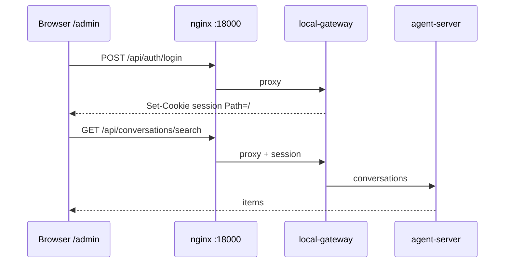

# Local Admin ↔ Canvas backend — Implementation Plan

## Phase 0: Input Clarification

- Ngôn ngữ/stack: TypeScript (Creanova `frontend/`), Nginx gateway, Python local-gateway (không đổi schema trừ khi thiếu endpoint)
- Codebase hiện có; phạm vi **multi-module**
- Security: Internal/local; session cookie local-auth `Path=/`
- Environment: Web, path gateway `:18000`
- Constraint: Không giả org Cloud; không bật MSW; `/monitoring` vẫn tách Beszel

## Phase 1: Requirements Analysis (EARS)

1. WHEN user mở `/admin/` qua gateway với `VITE_LOCAL_GATEWAY_ADMIN` THE SYSTEM SHALL không dùng MSW và SHALL gọi cùng origin `/api` tới local-gateway như `/agents/`
2. WHEN user chưa có session cookie THE SYSTEM SHALL đưa tới `/admin/login` và chấp nhận username/password local-auth (`admin`/`admin123`)
3. WHEN user đã login THE SYSTEM SHALL liệt kê conversation Canvas trên Usage (map `/api/conversations/search`)
4. WHEN user mở LLM settings THE SYSTEM SHALL đọc/ghi `/api/settings` (agent-server qua gateway)
5. WHEN user xem Users tab trên usage THE SYSTEM SHALL hiện `/api/admin/users` (credits) nếu role admin; không gọi Stripe budget
6. WHEN cookie `gateway_app=admin` THE SYSTEM SHALL route `/api` tới `agent-canvas:8000`, không còn Vite `:12000`
7. THE SYSTEM SHALL ẩn tab SaaS (git-claim, org Cloud, Stripe budget, onboarding)

## Phase 2: Specification

### Trade-off

| Approach | Pros | Cons | Complexity | Security | Recommendation |
|----------|------|------|------------|----------|----------------|
| A. Org ảo trên gateway | UI SaaS giữ nguyên | Sai mô hình, API giả | Med | Med | ❌ |
| B. Cắt UI + FE adapter | Đúng backend Canvas | Đụng nhiều file FE | Med | High (cookie sẵn có) | ✅ |
| C. Viết SaaS trên gateway | Đủ org/budget | Phạm vi sản phẩm mới | High | High | ❌ |

### Edge cases

| Edge Case | Trigger | Expected | Impact if ignored |
|-----------|---------|----------|-------------------|
| Mở `:12000/admin` trực tiếp | Không qua gateway | `/api` Vite proxy :3000 → fail | User phải dùng `:18000/admin/` |
| User không phải admin | GET `/api/admin/users` 403 | Users tab rỗng/ẩn | Toast 403 |
| Search không có metrics | Agent-server cũ | Cost/token = 0 | Dashboard trống metric, list vẫn có |

### Exception handling

| Exception | Source | Handling | Recovery |
|-----------|--------|----------|----------|
| 401 /api/auth/me | Hết session | Redirect login | Login lại |
| 404 /api/settings | Gateway/agent down | Query error, không crash layout | Sửa stack Canvas |
| Pause fail | stop conversation | Toast error | Thử lại |

### Race conditions

| Shared Resource | Scenario | Risk | Mitigation |
|-----------------|----------|------|------------|
| Session cookie | Login song song hai tab | Cookie ghi đè | Cookie mới wins; chấp nhận |
| Org store `local` | Auto-select vs user | N/A một org | Set một lần `id=local` |

## Phase 3: Implementation Planning

**Category:** Add Feature

ROOT: Add Feature: Local admin shares Canvas backend

1. Flag + config + axios credentials
2. Auth login/me/logout + login UI + root redirect
3. Settings loader/nav cho phép usage-monitoring
4. Map conversations/stats/stop/users + settings paths
5. Nginx admin `/api` → agent-canvas; npm script; README/CHANGELOG
6. Tests unit cho flag + mapping; Playwright smoke login+usage nếu được
