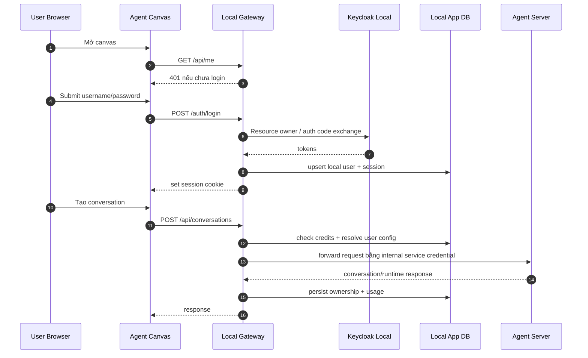

# Creanova - Kế hoạch triển khai Keycloak local + session riêng theo user

## Phase 0: Input Clarification

### Tóm tắt yêu cầu đã chốt
- Môi trường: web local/self-hosted cho `agent-canvas` + local agent-server
- Cơ chế đăng nhập: **Keycloak local**
- Quản lý tài khoản: **admin tạo user**
- Mức tách dữ liệu: **C** = tách toàn bộ theo user
  - session
  - conversations
  - credits/quota
  - agent profiles
  - secrets
  - LLM settings
  - MCP config

### Giả định
- Không tái dùng trực tiếp SaaS app-server hiện tại làm runtime chính cho local canvas.
- Keycloak sẽ chạy cục bộ bằng Docker Compose mới do repo này quản lý.
- Hệ thống mới phải hỗ trợ migration từ mô hình shared `X-Session-API-Key` sang mô hình user session.
- Admin thao tác tạo user chủ yếu qua Keycloak Admin UI hoặc script seed.

### Ranh giới scope
**Trong scope**
- Thêm luồng login/logout bằng username/password qua Keycloak local
- Thêm gateway/app-server local quản lý user session
- Tách dữ liệu theo `user_id`
- Thêm credits/quota theo user
- Gắn active user context vào conversation launch / profile / secrets / settings

**Ngoài scope giai đoạn đầu**
- Social login (Google/GitHub)
- Self-registration
- Billing thật / thanh toán
- Org/team/role phức tạp hơn admin-vs-user
- Sync user với SaaS cloud

---

## Phase 1: Requirements Analysis (EARS)

### User stories
1. Là admin, tôi muốn tạo user để phát tài khoản cho client.
2. Là user, tôi muốn login bằng username/password để dùng session riêng.
3. Là admin, tôi muốn đặt credits/quota cho từng user.
4. Là user, tôi muốn agent/profile/config của mình không bị lẫn với user khác.
5. Là hệ thống, tôi muốn chặn chạy agent khi user hết credits.

### EARS requirements
1. **WHEN** người dùng truy cập local canvas **THE SYSTEM SHALL** chuyển họ tới màn hình login nếu chưa có session hợp lệ.
2. **WHEN** người dùng nhập username/password hợp lệ **THE SYSTEM SHALL** xác thực qua Keycloak local và tạo session cookie riêng.
3. **WHEN** session cookie hợp lệ được gửi lên **THE SYSTEM SHALL** resolve ra `user_id` hiện hành cho mọi request.
4. **WHEN** user tạo conversation mới **THE SYSTEM SHALL** gắn conversation đó với `user_id`.
5. **WHEN** user đọc danh sách conversations **THE SYSTEM SHALL** chỉ trả về dữ liệu thuộc `user_id` đó.
6. **WHEN** user lưu LLM settings, secrets, MCP config hoặc agent profiles **THE SYSTEM SHALL** lưu dữ liệu trong namespace riêng theo `user_id`.
7. **WHEN** admin cấu hình credits/quota cho user **THE SYSTEM SHALL** lưu hạn mức và usage ledger cho user đó.
8. **WHEN** user bắt đầu một agent run **THE SYSTEM SHALL** kiểm tra credits còn lại trước khi cho phép thực thi.
9. **WHEN** usage phát sinh trong runtime **THE SYSTEM SHALL** cộng dồn usage vào ledger của đúng `user_id`.
10. **WHEN** user hết credits **THE SYSTEM SHALL** từ chối tạo run mới với lỗi rõ ràng ở UI.
11. **WHEN** admin disable hoặc xoá user trên Keycloak **THE SYSTEM SHALL** từ chối session mới của user đó.
12. **WHEN** user logout **THE SYSTEM SHALL** huỷ session local cookie và không cho truy cập tiếp.
13. **WHEN** request không có session hợp lệ **THE SYSTEM SHALL** trả `401` thay vì fallback sang shared session key.
14. **WHEN** hệ thống chạy lần đầu **THE SYSTEM SHALL** tạo realm/client/admin bootstrap cho Keycloak local theo cấu hình.

### Constraints
- Kiến trúc hiện tại của local agent-server đang single-tenant với shared session key.
- `agent-canvas` hiện chưa có login screen local kiểu account/password.
- Enterprise auth đã có flow Keycloak + signed cookie, nhưng gắn chặt với SaaS/user/org model.
- Thay đổi này là security-critical và multi-module.

### Non-functional requirements
- Dữ liệu không được rò giữa users.
- Auth flow phải hoạt động local-first, không phụ thuộc SaaS staging.
- Session handling phải an toàn với cookie `HttpOnly` và expiry rõ ràng.
- Credits checks phải idempotent ở boundary tạo run.

---

## Phase 2: Specification

### Kiến trúc đề xuất

#### Phương án khuyến nghị
Thêm một **local auth gateway/app-server** đứng trước local agent-server:



#### Thành phần mới
1. **Keycloak local**
   - realm local
   - confidential/public client cho web local
   - admin bootstrap

2. **Local Gateway**
   - login/logout endpoints
   - session cookie verification
   - local user store
   - credits/quota enforcement
   - namespace routing cho user-scoped data

3. **User-scoped persistence**
   - `users`
   - `sessions`
   - `user_credits`
   - `usage_ledger`
   - `user_conversations`
   - `user_profiles`
   - `user_settings`
   - `user_secrets`
   - `user_mcp_config`

4. **Agent server adapter changes**
   - bỏ assumption single-tenant ở local path
   - tất cả request ghi/đọc phải có user context do gateway cung cấp

### Data model tối thiểu

#### Auth / identity
- `users`
  - `id`
  - `keycloak_sub`
  - `username`
  - `email`
  - `status`
  - `created_at`
  - `updated_at`

- `user_sessions`
  - `id`
  - `user_id`
  - `refresh_token_ref` hoặc encrypted token blob
  - `expires_at`
  - `created_at`
  - `revoked_at`

#### Credits
- `user_credit_accounts`
  - `user_id`
  - `credit_balance`
  - `credit_limit`
  - `updated_at`

- `user_usage_ledger`
  - `id`
  - `user_id`
  - `conversation_id`
  - `run_id`
  - `usage_type`
  - `units`
  - `cost`
  - `created_at`

#### User-scoped agent data
- `user_agent_profiles`
- `user_llm_profiles`
- `user_settings`
- `user_secrets`
- `user_mcp_servers`
- `user_conversation_index`

### API surface tối thiểu

#### Auth
- `POST /auth/login`
- `POST /auth/logout`
- `GET /auth/me`
- `POST /auth/refresh`

#### Admin
- `GET /admin/users`
- `POST /admin/users/{user_id}/credits`
- `POST /admin/users/{user_id}/disable`

#### User-scoped resources
- Tất cả route hiện tại `/api/settings`, `/api/profiles`, `/api/conversations`, `/api/secrets`, `/api/mcp`, ... phải đọc/ghi theo `user_id` hiện hành.

### Trade-off analysis

| Approach | Pros | Cons | Complexity | Security | Recommendation |
|----------|------|------|------------|----------|----------------|
| A. Gắn Keycloak trực tiếp vào local agent-server | Sạch về mặt “mọi API đều auth” | Đập sâu vào agent-server single-tenant, migration khó, rủi ro cao | High | High | ❌ |
| B. Dùng enterprise SaaS stack nguyên khối cho local | Tận dụng auth có sẵn | Quá nặng, phụ thuộc nhiều phần SaaS/org/cloud không cần thiết | High | Med | ❌ |
| C. Keycloak local + gateway local + agent-server làm execution engine | Phù hợp nhu cầu, tách auth/business khỏi execution, rollout theo phase | Cần thêm service mới và mapping dữ liệu | Med/High | High | ✅ |

### Edge cases

| Edge Case | Trigger Condition | Expected Behavior | Impact if Ignored |
|-----------|-------------------|-------------------|-------------------|
| Session cookie hết hạn | User mở tab cũ sau nhiều giờ | Redirect/login required, không leak data | User tưởng còn login, request lỗi khó hiểu |
| User bị admin disable khi đang online | Session cũ còn tồn tại | Request kế tiếp bị revoke | User vẫn tiếp tục chạy agent trái phép |
| Credits chạm 0 giữa nhiều request song song | User click tạo run nhiều lần | Chỉ một số request hợp lệ, ledger atomic | Âm credits / bypass quota |
| Keycloak down tạm thời | Login/refresh đang diễn ra | Existing valid local session vẫn chạy tới expiry; login mới fail rõ ràng | Toàn hệ thống unusable |
| Migration từ shared key local cũ | Có dữ liệu sẵn trong state dir | Chuyển vào user admin bootstrap hoặc đánh dấu unowned để admin nhập lại | Mất dữ liệu / dữ liệu mồ côi |
| Secrets trùng tên ở nhiều user | `OPENAI_API_KEY` của nhiều user | Lưu namespace theo `user_id` | Lộ secret chéo user |
| Conversation restore | User cố mở id không thuộc mình | 404/403 | Data leak |

### Exception handling

| Exception Type | Source | Handling Strategy | Recovery Action |
|----------------|--------|-------------------|-----------------|
| Invalid credentials | Keycloak login | 401 + message thân thiện | User nhập lại |
| Token exchange failure | Keycloak / network | 502/503 + retry-safe message | Retry login |
| Session verification failure | Cookie tamper/expired | Clear cookie + 401 | Redirect login |
| Credits exceeded | Gateway quota check | 402/403 domain error | UI hiện hết credits |
| User-scoped data not found | Wrong profile/conversation id | 404 | User tạo mới hoặc chọn lại |
| Internal forward failure | Gateway -> agent-server | 502 + request id | Retry / inspect logs |

### Race conditions

| Shared Resource | Concurrent Access Scenario | Risk | Mitigation Strategy |
|-----------------|---------------------------|------|---------------------|
| `user_credit_accounts.balance` | 2 run start cùng lúc | Overspend | DB transaction + row lock / atomic decrement |
| `user_usage_ledger` | streaming usage updates + final settlement | double count | idempotency key theo `run_id` + `usage_phase` |
| `user_sessions` | logout song song refresh | zombie session | revoke token version + compare-and-swap |
| `user_profiles` active profile | 2 tabs đổi active profile | state overwrite | optimistic lock bằng revision |
| `user_settings` | save settings từ nhiều tabs | stale overwrite | version column / updated_at compare |
| migration shared -> user data | first boot migration chạy 2 lần | duplicate records | migration lock + one-shot marker |

### Bảo mật tối thiểu
- Cookie `HttpOnly`, `Secure` khi có TLS, `SameSite=Lax`
- Không expose Keycloak refresh token sang frontend JS
- Encrypt local secrets at rest
- Admin endpoints tách role rõ ràng
- Internal call gateway -> agent-server dùng service credential riêng, không reuse user cookie

---

## Phase 3: Implementation Planning

### Step 1 — Category
**Add Feature: local Keycloak auth + per-user sessions + credits + isolated agent data**

### Step 2 — Task hierarchy

#### ROOT TASK
Add Feature: Local Keycloak Auth And Per-User Runtime Isolation

#### Phase 1 - Bootstrap auth foundation

Task: Thêm local Keycloak compose và bootstrap realm  
Goal: Chạy được Keycloak local với admin account và web client cho canvas  
Files: `docker-compose.keycloak.yml`, scripts bootstrap mới, docs env mới  
Minimal change: thêm service Keycloak + seed realm/client  
Verify command: `docker compose -f docker-compose.keycloak.yml up -d`  
Expected output: Keycloak UI mở được và có realm/client bootstrap

Task: Thêm service gateway local  
Goal: Có local auth gateway đứng trước agent-server  
Files: thư mục service mới, entrypoint, config  
Minimal change: skeleton FastAPI/Node service với healthcheck  
Verify command: start gateway + `GET /healthz`  
Expected output: 200 OK

Task: Port auth flow enterprise vào local gateway  
Goal: Login/logout/me hoạt động với Keycloak local  
Files: auth router, token/cookie utilities, config constants  
Minimal change: chỉ hỗ trợ username/password + cookie session  
Verify command: login integration test  
Expected output: set-cookie + `GET /auth/me` trả user

#### Phase 2 - User-scoped persistence

Task: Thiết kế và tạo schema DB user/session/credits  
Goal: Có bảng tối thiểu cho identity + quota  
Files: DB models, migration files  
Minimal change: users, sessions, credit_accounts, usage_ledger  
Verify command: migration run  
Expected output: bảng tạo thành công

Task: Tách settings/secrets/profiles theo `user_id`  
Goal: Mọi config chính đều per-user  
Files: settings store, secrets store, profiles store, adapters  
Minimal change: thêm namespace `user_id` ở read/write path  
Verify command: unit tests store  
Expected output: user A không đọc được dữ liệu user B

Task: Tách conversations theo `user_id`  
Goal: danh sách và detail conversation đều user-scoped  
Files: conversation index/store/router adapter  
Minimal change: ownership mapping + filtered queries  
Verify command: API tests với 2 users  
Expected output: mỗi user chỉ thấy dữ liệu của mình

#### Phase 3 - Gateway to agent-server integration

Task: Thêm middleware resolve `user_id` từ session cookie  
Goal: mọi API gateway đều có user context  
Files: auth dependency/middleware  
Minimal change: attach `request.state.user`  
Verify command: protected route test  
Expected output: 401 khi không login, 200 khi login

Task: Forward API từ gateway sang agent-server bằng internal credential  
Goal: giữ agent-server như execution engine sau gateway  
Files: gateway proxy layer, internal auth config  
Minimal change: forward subset route + inject user context  
Verify command: create conversation qua gateway  
Expected output: conversation tạo được qua gateway

Task: Áp user context vào runtime artifacts  
Goal: bash events, workspace, conversation metadata không lẫn user  
Files: workspace path strategy, event mapping, metadata store  
Minimal change: prefix/namespace theo `user_id`  
Verify command: 2 users chạy song song  
Expected output: artifacts không đè nhau

#### Phase 4 - Credits and quota

Task: Thêm quota guard trước create/run conversation  
Goal: chặn user hết credits  
Files: gateway conversation launch service  
Minimal change: check balance trước run  
Verify command: test balance 0  
Expected output: request bị chặn với domain error

Task: Thêm usage settlement  
Goal: trừ credits theo usage thực tế  
Files: usage collector, ledger writer  
Minimal change: write ledger per run + aggregate balance  
Verify command: simulated run usage test  
Expected output: balance giảm đúng một lần

Task: Thêm admin APIs cho credit management  
Goal: admin set/add/revoke credits cho user  
Files: admin router + authorization  
Minimal change: set absolute / add delta  
Verify command: admin API tests  
Expected output: non-admin bị 403, admin update được

#### Phase 5 - Frontend integration

Task: Thêm login page local cho agent-canvas  
Goal: user local login bằng username/password  
Files: routes, auth store, login form, query hooks  
Minimal change: login/logout/me flow  
Verify command: frontend auth test  
Expected output: chưa login bị redirect tới login

Task: Thay backend selector local bằng session-aware app shell  
Goal: user không phải paste shared API key nữa  
Files: backend/auth UI, root routing  
Minimal change: local mode dùng gateway cookie auth  
Verify command: browser smoke test  
Expected output: vào app sau login, logout quay lại login

Task: Thêm UI credits + quota status  
Goal: user thấy balance còn lại  
Files: sidebar/header/settings/admin screens  
Minimal change: read-only badge trước, admin panel sau  
Verify command: UI test  
Expected output: balance hiển thị đúng

Task: Tách user-scoped settings/profiles/conversations ở UI  
Goal: FE phản ánh dữ liệu riêng từng user  
Files: query keys, caches, settings/profile/conversation pages  
Minimal change: clear cache on login switch, reload active user data  
Verify command: 2-user e2e  
Expected output: data không bleed giữa users

#### Phase 6 - Migration and hardening

Task: Migration dữ liệu local cũ  
Goal: đưa shared local state hiện tại sang user bootstrap/admin  
Files: migration script, docs  
Minimal change: one-time import path  
Verify command: migration dry run  
Expected output: trạng thái cũ còn truy cập được từ admin seed user

Task: Audit security + session hardening  
Goal: chặn privilege escalation và session fixation  
Files: auth middleware/tests/docs  
Minimal change: cookie rotation, revoke checks, role checks  
Verify command: security-focused tests  
Expected output: protected invariants pass

Task: Viết docs vận hành local Keycloak  
Goal: người vận hành biết boot, tạo user, set credits  
Files: README/self-host docs  
Minimal change: runbook + troubleshooting  
Verify command: docs review  
Expected output: một người mới có thể tự setup

### Directory structure dự kiến (phần mới)

```text
docs/
└── plan/
    └── plan_add_feature_local_keycloak_user_sessions_20260730.md  # Kế hoạch triển khai

agent-canvas/
├── src/
│   ├── routes/login.tsx                    # Màn login local
│   ├── hooks/query/use-auth-me.ts          # Query user hiện hành
│   ├── hooks/mutation/use-login.ts         # Login mutation
│   ├── hooks/mutation/use-logout.ts        # Logout mutation
│   └── state/auth-store.ts                 # Session/auth state phía FE
├── scripts/
│   └── dev-with-keycloak.mjs               # Dev launcher có Keycloak/gateway
└── config/
    └── keycloak-local.json                 # Cấu hình local auth bootstrap

services/local-gateway/
├── main.py                                 # Entry point gateway
├── auth/                                   # Login/session/authz
├── routers/                                # Auth/admin/user-scoped APIs
├── storage/                                # DB models + stores
└── tests/                                  # Test gateway

deploy/local-auth/
├── docker-compose.keycloak.yml             # Keycloak + db local
└── realm-export.json                       # Realm bootstrap
```

### Validate checklist
- [x] Theo workflow plan đầy đủ
- [x] Bao gồm testing
- [x] Có EARS requirements
- [x] Có trade-off / edge cases / exception / race tables
- [x] Chọn phương án đơn giản nhất khả thi cho scope C

---

## Quyết định kiến trúc khuyến nghị

**Khuyến nghị triển khai theo 2 milestone:**

### Milestone 1
- Keycloak local
- gateway login/logout/me
- user-scoped conversations/settings/profiles/secrets
- login UI local

### Milestone 2
- credits/quota
- admin user management helpers
- migration data cũ
- hardening và tài liệu vận hành

Milestone 1 đã đủ để thay shared key bằng session riêng theo user. Milestone 2 mới hoàn thiện bài toán product “credits + quản lý client”.
