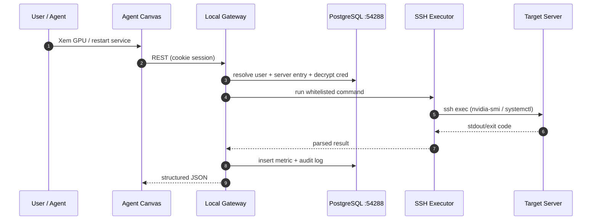
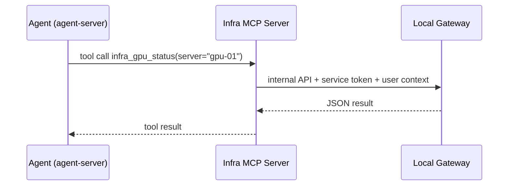
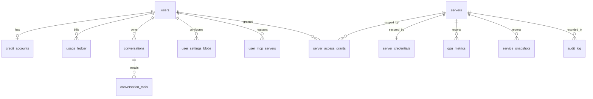

# Creanova - Kế hoạch PostgreSQL + Quản lý hạ tầng qua SSH (GPU/services)

Ngày tạo: 31/07/2026
Category: **Add Feature** (kèm 1 phase Migration SQLite → PostgreSQL)

---

## Phase 0: Input Clarification

### Yêu cầu người dùng (restate EN)
> Introduce PostgreSQL (host port **54288**) as the persistent store for conversations, installed agent tools, and related metadata. Final goal: SSH into configured servers to manage running services and probe GPU utilization, exposed as agent tools. Plan only — no implementation.

### Bối cảnh đã biết
- Ngôn ngữ/framework: Python 3.12 (FastAPI + SQLAlchemy 2 ở `services/local-gateway`), React 19 + TanStack Query (`agent-canvas`)
- Codebase: đã có sẵn, không phải project mới
- Scope: **Multi-module / System** (gateway, DB, canvas UI, agent tools)
- Security level: **Critical** — lưu SSH credentials và chạy lệnh từ xa
- Environment: self-hosted local (Atin191), backend + web
- Ràng buộc đã chốt:
  - Docker bridge **bắt buộc** nằm trong `10.240.0.0/16`, mỗi project một `/24`
  - Host port PostgreSQL: **54288**
  - Không dùng brand OpenHands trên bề mặt sản phẩm
  - Auth hiện tại: gateway local (SQLite) + tuỳ chọn Keycloak

### Giả định (cần xác nhận khi implement)
1. PostgreSQL chạy bằng Docker Compose do repo này quản lý (không dùng Postgres có sẵn trên host).
2. Agent-server **vẫn giữ** file-based persistence; Postgres đóng vai trò **index/mirror + metadata**, không thay thế storage của SDK.
3. Server inventory ban đầu nhập tay qua UI/API (chưa cần auto-discovery).
4. SSH key/password do admin cung cấp; agent **không** được đọc raw credential.
5. GPU probe dựa trên `nvidia-smi` có sẵn trên server đích.

### Ranh giới scope
**Trong scope**
- PostgreSQL service + migration schema (Alembic)
- Chuyển users/credits/conversations index/settings blobs từ SQLite sang Postgres
- Bảng mới: agent tools đã cài, MCP servers, server inventory, SSH credentials (mã hoá), metric snapshots, audit log
- SSH executor: chạy lệnh whitelist trên server đích
- Service management: list/status/restart systemd unit
- GPU probe: `nvidia-smi` → parse thành metric có cấu trúc
- Expose thành **agent tools** (MCP server nội bộ) + REST API + UI admin

**Ngoài scope giai đoạn này**
- Auto-discovery server trong LAN
- Provisioning/cài đặt phần mềm từ xa (chỉ đọc + restart service)
- Time-series DB chuyên dụng (Prometheus/VictoriaMetrics)
- Alerting/notification
- HA/replication cho Postgres

---

## Phase 1: Requirements Analysis (EARS)

### User stories
1. Là admin, tôi muốn dữ liệu user/credits/conversation nằm trong Postgres để backup và query ổn định.
2. Là admin, tôi muốn khai báo danh sách server (host, port, user, key) để hệ thống SSH vào được.
3. Là admin, tôi muốn xem service đang chạy trên từng server và restart khi cần.
4. Là user, tôi muốn hỏi agent "GPU server X còn trống bao nhiêu" và nhận số liệu thật.
5. Là admin, tôi muốn mọi lệnh chạy từ xa đều được ghi audit log.
6. Là hệ thống, tôi muốn credential SSH không bao giờ lộ ra frontend hay agent.

### EARS requirements

**Dữ liệu / Postgres**
1. **WHEN** gateway khởi động với `DATABASE_URL` trỏ Postgres **THE SYSTEM SHALL** chạy Alembic migration tới head trước khi phục vụ request.
2. **WHEN** Postgres không sẵn sàng **THE SYSTEM SHALL** fail fast với log rõ ràng thay vì im lặng fallback sang SQLite.
3. **WHEN** user tạo conversation **THE SYSTEM SHALL** ghi bản ghi index (id, owner, title, timestamps, trạng thái) vào Postgres.
4. **WHEN** agent-server báo tools/skills/MCP được kích hoạt cho một conversation **THE SYSTEM SHALL** lưu danh sách đó gắn với `conversation_id` và `user_id`.
5. **WHEN** admin chạy script migrate **THE SYSTEM SHALL** chuyển toàn bộ dữ liệu SQLite hiện có sang Postgres mà không mất ownership/credits.

**Server inventory + SSH**
6. **WHEN** admin tạo server entry **THE SYSTEM SHALL** lưu credential ở dạng mã hoá đối xứng, không lưu plaintext.
7. **WHEN** bất kỳ API nào trả về server entry **THE SYSTEM SHALL** loại bỏ trường credential khỏi response.
8. **WHEN** admin bấm "Test connection" **THE SYSTEM SHALL** mở SSH, chạy lệnh vô hại và trả về kết quả pass/fail kèm latency.
9. **WHEN** một lệnh SSH vượt quá timeout cấu hình **THE SYSTEM SHALL** huỷ lệnh và trả lỗi timeout thay vì treo request.
10. **WHEN** lệnh yêu cầu không nằm trong whitelist **THE SYSTEM SHALL** từ chối với lỗi rõ ràng và ghi audit.

**Service management**
11. **WHEN** user hỏi trạng thái service **THE SYSTEM SHALL** chạy lệnh liệt kê unit và trả về dạng có cấu trúc (name, active, sub, since).
12. **WHEN** user yêu cầu restart service **THE SYSTEM SHALL** kiểm tra quyền admin trước khi thực thi.
13. **WHEN** một hành động thay đổi trạng thái được thực thi **THE SYSTEM SHALL** ghi audit log gồm actor, server, lệnh, exit code, thời điểm.

**GPU**
14. **WHEN** user yêu cầu thông tin GPU **THE SYSTEM SHALL** chạy `nvidia-smi --query-gpu=... --format=csv` và parse thành bản ghi có kiểu.
15. **WHEN** server không có GPU hoặc thiếu `nvidia-smi` **THE SYSTEM SHALL** trả kết quả rỗng kèm lý do, không coi là lỗi hệ thống.
16. **WHEN** một GPU snapshot được thu thập **THE SYSTEM SHALL** lưu vào bảng metric kèm timestamp để tra cứu lịch sử ngắn hạn.

**Agent tools**
17. **WHEN** conversation của user được khởi tạo **THE SYSTEM SHALL** cung cấp MCP tool infra cho agent theo quyền của user đó.
18. **WHEN** agent gọi tool infra **THE SYSTEM SHALL** thực thi dưới danh nghĩa user hiện hành và tôn trọng phân quyền admin/user.

### Constraints
- Docker subnet phải trong `10.240.0.0/16`; Postgres host port cố định **54288**.
- Gateway hiện dùng SQLAlchemy nhưng **chưa có Alembic** → phải thêm.
- `charge_credits` đang dùng `with_for_update()` — SQLite bỏ qua, Postgres sẽ thực sự khoá hàng.
- SSH là bề mặt tấn công lớn → mặc định đóng, whitelist lệnh, audit đầy đủ.

### Non-functional requirements
- Credential mã hoá at-rest bằng key ngoài DB (env/file, không commit).
- Mọi thao tác đọc GPU/service phải hoàn tất < 10s hoặc timeout rõ ràng.
- Migration phải idempotent và có đường lùi (giữ file SQLite cũ).
- Audit log không được chứa secret.

---

## Phase 2: Specification

### Kiến trúc tổng thể



Agent đi cùng đường nhưng qua MCP:



### Quy hoạch port (chốt)

| Service | Host port | Ghi chú |
|---------|-----------|---------|
| Canvas ingress | 18010 | đã dùng (8000 bị Triton chiếm) |
| Vite dev | 3001 | đã dùng |
| Agent-server | 18000 | đã dùng |
| Automation backend | 18001 | đã dùng |
| Local gateway | 18110 | đã dùng |
| Keycloak (tuỳ chọn) | 18180 | Docker |
| **PostgreSQL** | **54288** | **mới** → container 5432 |
| Infra MCP server | 18120 | mới, bind loopback |
| pgAdmin (tuỳ chọn, dev) | 18130 | mới, mặc định tắt |

### Quy hoạch Docker subnet (rule Atin191)

| Compose project | Network | Subnet |
|-----------------|---------|--------|
| Root app | `creanova_net` | `10.240.121.0/24` |
| Local auth (Keycloak) | `creanova_local_auth_net` | `10.240.122.0/24` |
| **Data (PostgreSQL)** | `creanova_data_net` | **`10.240.123.0/24`** |
| Dự phòng | — | `10.240.124.0/24` trở đi |

Bắt buộc kiểm tra sau khi lên: `ip route get <client_ip>` không được đi qua `br-*`.

### Data model bổ sung

**Chuyển sang Postgres (đã có, giữ nguyên semantics)**
- `users`, `credit_accounts`, `usage_ledger`, `user_conversations`, `user_settings_blobs`

**Bảng mới — conversation & tools**
- `conversations_index`: `conversation_id` (PK), `user_id`, `title`, `status`, `created_at`, `updated_at`, `last_activity_at`
- `conversation_tools`: `id`, `conversation_id`, `tool_kind` (`builtin|skill|mcp|plugin`), `tool_name`, `version`, `source`, `enabled`, `installed_at`
- `user_mcp_servers`: `id`, `user_id`, `name`, `transport`, `config_json`, `enabled`, `created_at`

**Bảng mới — hạ tầng**
- `servers`: `id`, `name` (unique), `hostname`, `port` (default 22), `username`, `auth_type` (`key|password`), `tags`, `description`, `is_active`, `created_by`, `created_at`
- `server_credentials`: `server_id` (PK/FK), `ciphertext`, `key_id`, `updated_at` — **không bao giờ trả ra API**
- `server_access_grants`: `id`, `server_id`, `user_id`, `permission` (`read|operate`), `granted_by`, `created_at`
- `gpu_metrics`: `id`, `server_id`, `gpu_index`, `name`, `mem_total_mb`, `mem_used_mb`, `util_gpu_pct`, `util_mem_pct`, `temp_c`, `power_w`, `collected_at`
- `service_snapshots`: `id`, `server_id`, `unit_name`, `active_state`, `sub_state`, `since`, `collected_at`
- `infra_audit_log`: `id`, `actor_user_id`, `server_id`, `action`, `command`, `exit_code`, `duration_ms`, `success`, `error_excerpt`, `created_at`

### API surface dự kiến

```
# Servers (admin)
GET    /api/infra/servers
POST   /api/infra/servers
PATCH  /api/infra/servers/{id}
DELETE /api/infra/servers/{id}
POST   /api/infra/servers/{id}/credentials     # ghi đè, chỉ nhận, không trả
POST   /api/infra/servers/{id}/test

# Đọc trạng thái (read grant)
GET    /api/infra/servers/{id}/gpu
GET    /api/infra/servers/{id}/services
GET    /api/infra/servers/{id}/metrics/gpu?since=...

# Thao tác (operate grant / admin)
POST   /api/infra/servers/{id}/services/{unit}/restart
POST   /api/infra/servers/{id}/services/{unit}/stop

# Audit
GET    /api/infra/audit?server_id=&limit=
```

### MCP tools cho agent

| Tool | Input | Quyền | Mô tả |
|------|-------|-------|-------|
| `infra_list_servers` | — | read | Liệt kê server user được cấp quyền |
| `infra_gpu_status` | `server` | read | GPU util/mem hiện tại |
| `infra_list_services` | `server`, `filter?` | read | Trạng thái systemd unit |
| `infra_service_action` | `server`, `unit`, `action` | operate | restart/stop có audit |
| `infra_run_command` | `server`, `command_id`, `args?` | operate | Chỉ chạy lệnh trong whitelist đặt tên sẵn |

`infra_run_command` **không** nhận chuỗi shell tự do — chỉ nhận `command_id` đã đăng ký trong catalog phía server.

### Trade-off analysis

| # | Quyết định | Option | Pros | Cons | Complexity | Security | Chọn |
|---|-----------|--------|------|------|------------|----------|------|
| 1 | Vị trí Postgres | A. Docker Compose riêng (`deploy/data`) | Cô lập, subnet riêng, dễ backup | Thêm 1 compose | Low | Med | ✅ |
| 1 | | B. Gộp vào compose Keycloak | Ít file | Coupling auth ↔ data, khó tắt riêng | Low | Med | ❌ |
| 1 | | C. Postgres cài trực tiếp host | Không cần Docker | Khó tái lập, xung đột version | Med | Med | ❌ |
| 2 | Phạm vi Postgres | A. Chỉ gateway metadata + index | Nhỏ gọn, không đụng SDK | Conversation content vẫn ở file | Med | High | ✅ |
| 2 | | B. Thay toàn bộ persistence agent-server | Một nguồn dữ liệu | Phải fork SDK, rủi ro rất cao | High | Med | ❌ |
| 3 | Migration tool | A. Alembic | Chuẩn SQLAlchemy, có downgrade | Thêm dependency + config | Low | High | ✅ |
| 3 | | B. `create_all` + ALTER thủ công | Không thêm gì | Không versioned, dễ lệch môi trường | Low | Low | ❌ |
| 4 | SSH client | A. `asyncssh` | Async hợp FastAPI, key/password, timeout | Thêm dependency | Low | High | ✅ |
| 4 | | B. `paramiko` + threadpool | Phổ biến | Sync, phải wrap executor | Med | Med | ❌ |
| 4 | | C. subprocess `ssh` | Không dependency | Khó kiểm soát, phụ thuộc known_hosts host | Med | Low | ❌ |
| 5 | Lệnh từ xa | A. Whitelist theo `command_id` | Chặn injection triệt để | Kém linh hoạt | Low | High | ✅ |
| 5 | | B. Cho phép shell tự do có audit | Linh hoạt tối đa | RCE thực sự nếu lộ session | Low | Very Low | ❌ |
| 6 | Mã hoá credential | A. Fernet key từ env/file | Đơn giản, đủ cho local | Key nằm cạnh app | Low | Med-High | ✅ |
| 6 | | B. HashiCorp Vault | Chuẩn enterprise | Quá nặng cho local | High | High | ❌ |
| 7 | Thu thập GPU | A. On-demand khi có request | Không tốn tài nguyên nền | Không có lịch sử liên tục | Low | High | ✅ (giai đoạn 1) |
| 7 | | B. Poller nền định kỳ | Có time-series | Thêm scheduler, tải SSH liên tục | Med | Med | ⏳ (giai đoạn sau) |

### Edge cases

| Edge Case | Trigger | Expected Behavior | Impact nếu bỏ qua |
|-----------|---------|-------------------|-------------------|
| Postgres chưa sẵn sàng khi gateway boot | `docker compose up` chậm | Retry có backoff rồi fail fast kèm log | Gateway chạy nhưng mọi API 500 khó hiểu |
| Port 54288 đã bị chiếm | Service khác dùng trước | Compose fail rõ ràng, docs hướng dẫn đổi | Container không lên, mất thời gian dò |
| SQLite đã có dữ liệu khi migrate | Đã dùng Milestone 1/2 | Script copy đầy đủ users/credits/ownership, chạy 2 lần không nhân bản | Mất credits/ownership hoặc double credit |
| Server đích không có `nvidia-smi` | Server CPU-only | Trả `gpus: []` + `reason` | Người dùng tưởng hệ thống hỏng |
| SSH host key đổi | Server cài lại | Từ chối kết nối + hướng dẫn cập nhật fingerprint | MITM không bị phát hiện |
| Credential sai/hết hạn | Xoay key | Trả lỗi auth rõ ràng, đánh dấu server unhealthy | Retry vô ích, log rác |
| `systemctl restart` cần sudo | User SSH không đủ quyền | Trả lỗi permission kèm gợi ý cấu hình sudoers | Agent báo thành công sai |
| Unit name chứa ký tự lạ | Input từ agent | Validate regex tên unit trước khi ghép lệnh | Command injection |
| Server bị disable giữa chừng | Admin tắt | Request kế tiếp bị từ chối | Vẫn thao tác lên server đã gỡ |
| Nhiều GPU trên một máy | Server 4–8 GPU | Trả list theo `gpu_index`, không gộp | Số liệu sai lệch |
| Output `nvidia-smi` format lạ | Driver version khác | Parse defensive, phần lỗi trả `null` | Crash endpoint |
| Agent hỏi server user không có quyền | Cross-user | 403 và audit | Rò rỉ hạ tầng giữa các user |

### Exception handling

| Exception | Nguồn | Chiến lược | Recovery |
|-----------|-------|-----------|----------|
| `OperationalError` (DB down) | SQLAlchemy | Retry ngắn → 503 | Kiểm tra container Postgres |
| Alembic conflict | Migration | Fail fast khi boot | Chạy `alembic upgrade head` thủ công |
| `asyncssh.PermissionDenied` | SSH auth | 401 domain error, đánh dấu unhealthy | Admin cập nhật credential |
| `asyncssh.HostKeyNotVerifiable` | SSH | 409 + fingerprint hiện tại | Admin xác nhận fingerprint mới |
| `TimeoutError` | Lệnh chạy lâu | Huỷ + 504 + audit `success=false` | Giảm scope lệnh |
| Exit code ≠ 0 | Lệnh từ xa | Trả stdout/stderr rút gọn, không raise 500 | User đọc lỗi thật |
| Parse `nvidia-smi` lỗi | Driver khác | Trả raw + `parse_error` | Cập nhật parser |
| Decrypt fail | Đổi encryption key | 500 rõ ràng "credential unreadable" | Nhập lại credential |
| Insufficient credits (nếu tính phí tool) | Credit guard | 402 như hiện tại | Admin nạp thêm |

### Race conditions

| Shared resource | Kịch bản đồng thời | Rủi ro | Mitigation |
|-----------------|--------------------|--------|------------|
| `credit_accounts.balance` | 2 run song song | Overspend | `SELECT ... FOR UPDATE` (Postgres thực thi thật) + ledger idempotent theo `run_id` |
| `servers` + `server_credentials` | Admin sửa trong lúc lệnh đang chạy | Dùng credential cũ/lỗi | Snapshot credential vào bộ nhớ lúc bắt đầu; version column trên `servers` |
| Restart cùng 1 unit từ 2 phiên | Double restart | Service flap | Advisory lock Postgres theo `(server_id, unit)`, TTL ngắn |
| Thu thập GPU đồng thời | Nhiều request cùng lúc | Spam SSH | Single-flight cache 5s theo `server_id` |
| Migration chạy 2 lần | Hai tiến trình boot | Duplicate rows | Alembic version table + advisory lock khi migrate |
| Audit log ghi song song | Nhiều thao tác | Không có (append-only) | Không cần khoá |

### Bảo mật tối thiểu
- Credential mã hoá Fernet, key đọc từ `INFRA_ENCRYPTION_KEY` (env/file `0600`), **không** commit.
- Response API luôn loại bỏ trường credential (test bắt buộc cho EARS #7).
- Whitelist lệnh theo `command_id`; validate `unit` bằng regex `^[A-Za-z0-9@._-]+\.(service|socket|timer)$`.
- Host key verification bật mặc định; lưu fingerprint trong `servers`.
- Postgres bind `127.0.0.1:54288` (không `0.0.0.0`) trừ khi có nhu cầu rõ ràng.
- Password Postgres đọc từ `.env` gitignored, không hardcode trong compose.
- Audit log ghi mọi hành động thay đổi trạng thái.

---

## Phase 3: Implementation Planning

### Step 1 — Category
**Add Feature**: PostgreSQL persistence + infra management (SSH/services/GPU) exposed as agent tools.
Bao gồm 1 phase **Migration** nội bộ (SQLite → Postgres).

### Step 2 — Cấu trúc thư mục mới

```text
deploy/
└── data/
    ├── docker-compose.yml            # Postgres 16, host 54288, subnet 10.240.123.0/24
    ├── .env.example                  # POSTGRES_PASSWORD mẫu
    └── README.md                     # Boot, backup, restore, đổi port

services/local-gateway/
├── alembic.ini                       # Cấu hình Alembic
├── migrations/
│   ├── env.py                        # Alembic runtime
│   └── versions/                     # Migration files
├── storage/
│   ├── infra_models.py               # servers, credentials, grants, metrics, audit
│   └── conversations.py              # conversations_index + conversation_tools
├── infra/
│   ├── crypto.py                     # Fernet encrypt/decrypt credential
│   ├── ssh_client.py                 # asyncssh wrapper + timeout + host key
│   ├── commands.py                   # Catalog lệnh whitelist theo command_id
│   ├── gpu.py                        # Chạy + parse nvidia-smi
│   ├── services.py                   # systemctl list/status/restart
│   └── audit.py                      # Ghi infra_audit_log
├── routers/
│   └── infra.py                      # REST /api/infra/*
├── scripts/
│   └── migrate_sqlite_to_postgres.py # Chuyển dữ liệu Milestone 1/2
└── tests/
    ├── test_infra_crypto.py
    ├── test_infra_commands.py
    ├── test_gpu_parser.py
    └── test_infra_api.py

services/infra-mcp/
├── main.py                           # MCP server (entry point tại root service)
├── tools.py                          # Định nghĩa 5 tool infra
└── README.md

agent-canvas/src/
├── api/infra/client.ts               # Data access layer
├── hooks/query/use-infra-servers.ts  # TanStack Query hooks
├── hooks/mutation/use-infra-actions.ts
└── routes/
    ├── infra-servers.tsx             # Danh sách + test connection
    └── infra-server-detail.tsx       # GPU + services + audit
```

### Step 3 — Task hierarchy

#### ROOT TASK
Add Feature: PostgreSQL Persistence And SSH-Based Infrastructure Management

---

#### Phase A — Nền tảng PostgreSQL

**Task A1: Tạo Compose PostgreSQL**
Goal: Có Postgres chạy ở host port 54288, subnet đúng rule
Files: `deploy/data/docker-compose.yml`, `deploy/data/.env.example`, `deploy/data/README.md`
Minimal change: 1 service `postgres:16-alpine`, volume named, healthcheck, bind `127.0.0.1:54288:5432`, network `10.240.123.0/24`
Verify command: `docker compose -f deploy/data/docker-compose.yml up -d && docker compose -f deploy/data/docker-compose.yml ps`
Expected output: container healthy; `ip route get <client_ip>` vẫn đi qua gateway LAN

**Task A2: Thêm Alembic vào gateway**
Goal: Migration versioned thay cho `create_all`
Files: `services/local-gateway/alembic.ini`, `migrations/env.py`, `migrations/versions/0001_initial.py`
Minimal change: baseline migration khớp schema hiện tại
Verify command: `alembic upgrade head && alembic current`
Expected output: version head, bảng tạo đủ trên Postgres

**Task A3: Bật driver Postgres + fail fast**
Goal: Gateway kết nối Postgres, không im lặng fallback
Files: `services/local-gateway/config.py`, `storage/models.py`, `main.py`, `pyproject.toml`
Minimal change: thêm `psycopg[binary]`, bỏ nhánh `create_all` khi không phải SQLite, retry ngắn khi boot
Verify command: `DATABASE_URL=postgresql+psycopg://... uv run python main.py` rồi `curl /healthz`
Expected output: 200; tắt Postgres → log lỗi rõ ràng, không 500 mơ hồ

**Task A4: Script migrate SQLite → Postgres**
Goal: Không mất dữ liệu Milestone 1/2
Files: `services/local-gateway/scripts/migrate_sqlite_to_postgres.py`
Minimal change: copy users, credit_accounts, usage_ledger, user_conversations, user_settings_blobs; mặc định dry-run
Verify command: `python scripts/migrate_sqlite_to_postgres.py --sqlite ... --apply` rồi so số bản ghi
Expected output: số bản ghi khớp; chạy lần 2 không nhân bản

**Task A5: Cập nhật launcher + docs**
Goal: `npm run dev` trỏ Postgres khi bật
Files: `agent-canvas/scripts/dev-with-automation.mjs`, `agent-canvas/.env.sample`, `services/local-gateway/README.md`
Minimal change: env `OH_DATA_BACKEND=postgres`, `LOCAL_GATEWAY_DATABASE_URL` mặc định port 54288
Verify command: `npm run dev` + login demo
Expected output: banner hiện DB backend; login OK

---

#### Phase B — Conversations & agent tools trong DB

**Task B1: Bảng conversations_index + conversation_tools**
Goal: Có schema lưu index conversation và tools đã cài
Files: `storage/conversations.py`, `migrations/versions/0002_conversations.py`
Minimal change: 2 bảng + index theo `user_id`, `conversation_id`
Verify command: `alembic upgrade head`
Expected output: bảng tồn tại, constraint đúng

**Task B2: Ghi index khi tạo/cập nhật conversation**
Goal: Proxy ghi metadata song song với ownership
Files: `services/local-gateway/proxy.py`
Minimal change: mở rộng nhánh POST `/api/conversations` đang có, không thêm route mới
Verify command: tạo conversation qua UI rồi query bảng
Expected output: 1 dòng index đúng owner/title

**Task B3: Ghi tools/skills/MCP đã kích hoạt**
Goal: Biết conversation dùng tool gì
Files: `services/local-gateway/proxy.py`, `storage/conversations.py`
Minimal change: parse response start-conversation, upsert `conversation_tools`
Verify command: tạo conversation có bật browser tool rồi query
Expected output: dòng tool tương ứng, chạy lại không duplicate

**Task B4: API đọc lịch sử tools**
Goal: UI/agent tra được tool đã cài
Files: `routers/credits.py` hoặc router mới `routers/conversations.py`
Minimal change: `GET /api/conversations/{id}/tools` lọc theo owner
Verify command: `curl -b cookie /api/conversations/<id>/tools`
Expected output: JSON list; user khác → 403

---

#### Phase C — Server inventory + SSH core

**Task C1: Model + migration hạ tầng**
Goal: Có bảng servers/credentials/grants/audit
Files: `storage/infra_models.py`, `migrations/versions/0003_infra.py`
Minimal change: đúng 4 bảng, chưa có metric
Verify command: `alembic upgrade head`
Expected output: bảng tạo đủ, FK đúng

**Task C2: Lớp mã hoá credential**
Goal: Credential không lưu plaintext
Files: `infra/crypto.py`, `tests/test_infra_crypto.py`
Minimal change: Fernet encrypt/decrypt + key từ env
Verify command: `pytest tests/test_infra_crypto.py -q`
Expected output: roundtrip pass; sai key → lỗi rõ ràng

**Task C3: SSH client wrapper**
Goal: Chạy lệnh có timeout và host key verification
Files: `infra/ssh_client.py`, `pyproject.toml`
Minimal change: `asyncssh`, hàm `run(server, command, timeout)` trả `(exit_code, stdout, stderr, duration)`
Verify command: test với `localhost` bằng key dev
Expected output: `echo ok` trả exit 0

**Task C4: Catalog lệnh whitelist**
Goal: Chặn command injection
Files: `infra/commands.py`, `tests/test_infra_commands.py`
Minimal change: dict `command_id` → template + validator tham số
Verify command: `pytest tests/test_infra_commands.py -q`
Expected output: `command_id` lạ bị từ chối; unit name có `;` bị chặn

**Task C5: CRUD server + test connection**
Goal: Admin khai báo server qua API
Files: `routers/infra.py`, `main.py`
Minimal change: CRUD + `POST /test`, response không chứa credential
Verify command: `curl` tạo server rồi GET lại
Expected output: không thấy trường credential; test trả pass/fail + latency

**Task C6: Audit log**
Goal: Ghi lại mọi thao tác
Files: `infra/audit.py`, `routers/infra.py`
Minimal change: helper ghi bản ghi sau mỗi lệnh
Verify command: chạy test connection rồi `GET /api/infra/audit`
Expected output: có bản ghi, không chứa secret

---

#### Phase D — GPU & service management

**Task D1: Bảng metric**
Goal: Lưu snapshot GPU/service
Files: `storage/infra_models.py`, `migrations/versions/0004_metrics.py`
Minimal change: `gpu_metrics`, `service_snapshots` + index `(server_id, collected_at)`
Verify command: `alembic upgrade head`
Expected output: bảng tạo đủ

**Task D2: GPU probe + parser**
Goal: Đọc GPU thành dữ liệu có kiểu
Files: `infra/gpu.py`, `tests/test_gpu_parser.py`
Minimal change: `nvidia-smi --query-gpu=... --format=csv,noheader,nounits` + parser defensive
Verify command: `pytest tests/test_gpu_parser.py -q`
Expected output: parse đúng multi-GPU; thiếu `nvidia-smi` → list rỗng + reason

**Task D3: Service listing/status**
Goal: Xem systemd unit
Files: `infra/services.py`
Minimal change: `systemctl list-units --type=service --no-pager --plain`
Verify command: gọi API trên server dev
Expected output: list có `name/active/sub`

**Task D4: Service action có phân quyền**
Goal: Restart/stop an toàn
Files: `routers/infra.py`, `infra/services.py`
Minimal change: yêu cầu grant `operate`, advisory lock theo `(server_id, unit)`
Verify command: user thường gọi restart
Expected output: 403; admin → 200 + audit

**Task D5: Single-flight cache cho GPU**
Goal: Tránh spam SSH
Files: `infra/gpu.py`
Minimal change: cache 5s theo `server_id`
Verify command: gọi 10 request song song, đếm phiên SSH
Expected output: 1 phiên SSH

---

#### Phase E — Agent tools (MCP)

**Task E1: Khung MCP server**
Goal: Có server MCP nội bộ ở 18120
Files: `services/infra-mcp/main.py`, `README.md`
Minimal change: MCP stdio/http tối thiểu + healthcheck
Verify command: khởi động và list tools
Expected output: 5 tool xuất hiện

**Task E2: Cài đặt 5 tool infra**
Goal: Agent gọi được API gateway
Files: `services/infra-mcp/tools.py`
Minimal change: gọi REST gateway kèm service token + user context
Verify command: gọi `infra_gpu_status` bằng client test
Expected output: JSON đúng schema

**Task E3: Phân quyền theo user cho tool**
Goal: Không rò rỉ hạ tầng cross-user
Files: `routers/infra.py`, `services/infra-mcp/tools.py`
Minimal change: token mang `user_id`, gateway kiểm tra grant
Verify command: user không có grant gọi tool
Expected output: 403 + audit

**Task E4: Đăng ký MCP vào conversation**
Goal: Agent thấy tool khi chạy
Files: `services/local-gateway/proxy.py` hoặc seed MCP config per-user
Minimal change: thêm entry MCP vào config user khi bật flag
Verify command: tạo conversation, hỏi agent list tools
Expected output: agent liệt kê tool infra

---

#### Phase F — UI + vận hành

**Task F1: Data access layer + hooks**
Goal: Đúng kiến trúc canvas (UI → hooks → api)
Files: `agent-canvas/src/api/infra/client.ts`, `hooks/query/use-infra-servers.ts`, `hooks/mutation/use-infra-actions.ts`
Minimal change: chỉ các endpoint đã có
Verify command: `cd agent-canvas && npm run build`
Expected output: build pass

**Task F2: Trang danh sách server**
Goal: Admin quản lý inventory
Files: `agent-canvas/src/routes/infra-servers.tsx`, `src/routes.ts`
Minimal change: bảng + form thêm server + nút test
Verify command: `npm run test`
Expected output: test pass, trang render

**Task F3: Trang chi tiết server**
Goal: Xem GPU/services/audit
Files: `agent-canvas/src/routes/infra-server-detail.tsx`
Minimal change: 3 khối read-only + nút restart cho admin
Verify command: smoke thủ công
Expected output: hiện GPU + service, restart ghi audit

**Task F4: Backup/restore + runbook**
Goal: Vận hành được
Files: `deploy/data/README.md`, `services/local-gateway/README.md`
Minimal change: `pg_dump`/`pg_restore`, đổi port, xử lý sự cố
Verify command: dump rồi restore vào DB tạm
Expected output: dữ liệu khớp

**Task F5: Bộ test tổng hợp**
Goal: Chốt các invariant bảo mật
Files: `services/local-gateway/tests/test_infra_api.py`
Minimal change: test credential không lộ, cross-user 403, whitelist chặn injection
Verify command: `uv run --with pytest python -m pytest tests/ -q`
Expected output: toàn bộ pass

### Step 5 — Validate checklist
- [x] Theo đúng 4 phase của workflow plan
- [x] Có testing ở mọi phase (C2, C4, D2, E3, F5)
- [x] EARS requirements đầy đủ và truy vết được tới task
- [x] Có đủ 4 bảng bắt buộc: trade-off, edge cases, exception, race condition
- [x] KISS/YAGNI: bỏ Vault, bỏ time-series DB, bỏ auto-discovery, bỏ poller nền ở giai đoạn 1
- [x] Quy hoạch port và Docker subnet rõ ràng

---

## Thứ tự triển khai đề xuất

| Milestone | Nội dung | Kết quả đo được |
|-----------|----------|-----------------|
| **M3** | Phase A + B | Postgres 54288 chạy, dữ liệu cũ migrate xong, conversation/tools có index |
| **M4** | Phase C | Khai báo server, SSH test connection pass, audit hoạt động |
| **M5** | Phase D | GPU + service status đọc được qua API |
| **M6** | Phase E + F | Agent gọi được tool infra, UI admin dùng được, có runbook backup |

## Phụ lục: Thiết kế SQL

DDL đầy đủ: [`docs/plan/schema/creanova_pg_schema_20260731.sql`](schema/creanova_pg_schema_20260731.sql)



Quyết định schema đáng chú ý:

| Quyết định | Lý do |
|-----------|-------|
| `NUMERIC(18,4)` cho balance/cost thay vì `Float` | Float tích luỹ sai số qua nhiều lần cộng trừ, không dùng cho số dư |
| Partial unique index `(user_id, run_id)` trên `usage_ledger` | Biến idempotency của `charge_credits` thành ràng buộc DB; SELECT-rồi-INSERT hiện tại có thể trừ tiền 2 lần trên Postgres |
| `CHECK (balance >= 0)` | Chốt bất biến ở lớp cuối, không phụ thuộc code |
| View `user_conversations` trên bảng `conversations` | Auto-updatable view → migrate schema trước, đổi code sau |
| Tách `server_credentials` thành bảng riêng | `SELECT *` trên `servers` không bao giờ lộ secret; REVOKE được cho role read-only |
| Schema `infra` tách khỏi `public` | Phân quyền và backup theo nhóm |
| `infra.has_server_access()` là hàm DB | REST API và MCP tool dùng chung một bản logic phân quyền |
| RULE chặn UPDATE/DELETE trên `audit_log` | Append-only, log không bị dọn sau sự cố |
| `infra.gpu_latest` view thay cache in-process | Single-flight vẫn đúng khi chạy nhiều worker |
| CHECK regex trên `servers.name` và `unit_name` | Chặn command injection ngay tại DB, không chỉ ở tầng app |

## Rủi ro chính cần theo dõi
1. **SSH là RCE có kiểm soát** — nếu whitelist bị nới lỏng, toàn bộ mô hình bảo mật sụp. Không thêm `run_raw_shell`.
2. **Encryption key** — mất key = mất toàn bộ credential. Cần ghi rõ trong runbook nơi lưu và cách backup.
3. **Postgres port 54288 công khai** — chỉ bind loopback; nếu cần LAN thì phải có firewall rule riêng.
4. **Migration một chiều** — giữ file SQLite cũ ít nhất một chu kỳ trước khi xoá.
